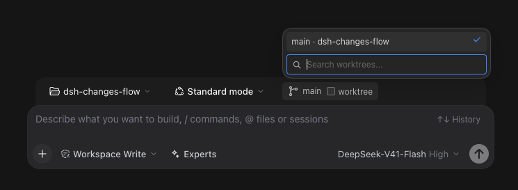
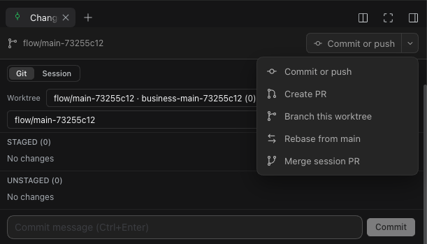

# dsh-changes-flow

A DSH plugin that adds Git actions to the `dsh-better-sidebar` Changes tab and a worktree switcher to the new-session composer.

## Features

- **Changes tab:** show the selected worktree's branch and change count; stage and commit changes; create a branch; prepare a pull request; request a rebase; and merge a pull request recorded in the session. Actions that run Git use the worktree selected in the Changes tab.
- **New-session composer:** show the current branch, open an existing worktree by its branch and folder, or create a linked worktree. Opening an existing worktree only switches DSH workspaces; it does not run `git checkout` or create another worktree.
- **Plugin settings:** turn the Changes tab actions and composer switcher on or off independently.

The worktree checkbox creates a new linked worktree on a `flow/<base>-<id>` branch when checked from the main checkout. It shows **Creating worktree…** and **Opening worktree…** while those steps run. From a linked worktree, unchecking it opens the main workspace without deleting the linked worktree. Branches without an existing worktree do not appear in the switcher.

### Worktree switcher



### Changes tab actions



## Requirements

- DSH with `dsh-better-sidebar` 0.21.1 or a newer compatible version
- Node.js 20 or newer and Bun to build from source
- A Git repository with at least one commit to create a worktree

## Install

Clone and build the package:

```sh
git clone https://github.com/JC-lurker/dsh-changes-flow.git
cd dsh-changes-flow
npm ci
npm run build
```

Install it in a DSH profile, replacing the path with the absolute path to the cloned directory:

```sh
dsh plugin --profile web add /absolute/path/to/dsh-changes-flow
```

Restart DSH so the plugin's host and client code load. The package's `dsh.bundle.patch` registers the Cordis component during installation. On DSH Codex Desktop, if `dsh` is not on `PATH`, use `node "$HOME/Library/Application Support/DSH Codex Desktop/dsh-runtime/node_modules/@deepseek-ai/dsh/lib/bin.js"` in place of `dsh`.

To uninstall:

```sh
dsh plugin --profile web remove dsh-changes-flow
```

## Development

```sh
npm test
```

This builds both plugin bundles and runs host Git-route tests in temporary repositories. A squash merge leaves its changes staged for a later commit.
